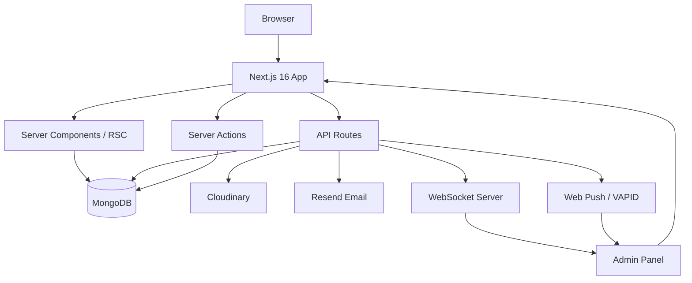

# Maazul Haque — Portfolio

A full-stack personal portfolio website for Maazul Haque, built with Next.js 16, React 19, TypeScript, and MongoDB. Features a cinematic image-sequence hero, GSAP-powered scroll animations, an admin CMS for content management, WebSocket real-time updates, web push notifications, and full SEO optimization.

**Production:** [https://maazulhaque.qd.je](https://maazulhaque.qd.je)

---

## Overview

This is a single-page portfolio with dedicated case-study pages. The site is server-rendered, dynamically generated from MongoDB content, and managed through a built-in admin panel. All content — projects, experience, services, tech stack, reviews, site settings, and social links — is CMS-driven.

---

## Features

### Frontend

- **Cinematic Hero** — 300-frame image sequence rendered on `<canvas>` with scroll-driven animation via GSAP ScrollTrigger
- **Editorial Typography** — scroll-phased name, title, and role text with opacity/blur transitions
- **About Section** — clip-reveal portrait, parallax scroll, bio text with staggered reveals
- **Projects Rail** — horizontal pinned scroll on desktop, native snap-scroll on mobile, with cover-image scale and clip animations
- **Experience Timeline** — editorial timeline with scrubbed year parallax and progress line
- **Tech Stack** — animated card grid with hover depth effect, featured/view-all toggle, brand-color glow
- **Services Grid** — premium cards with staggered GSAP entry reveals
- **Reviews Carousel** — 3D coverflow carousel with touch/swipe, keyboard navigation, and auto-play (pauses on hover/focus)
- **Contact Form** — server-action powered form with validation and email notifications
- **Footer** — editorial CTA, social links, back-to-top

### Admin CMS

Full admin panel at `/admin` for managing all site content:

| Section | Capabilities |
|---------|-------------|
| **Projects** | CRUD, case-study fields (overview, challenge, solution, process, results, gallery), slug, featured toggle, publish toggle, ordering |
| **Experience** | CRUD, role, company, date range, current flag, tech tags, ordering |
| **Tech Stack** | CRUD, name, category, logo upload, **featured toggle**, ordering |
| **Services** | CRUD, title, description, tag, ordering |
| **Reviews** | Moderation (approve/reject), public submission with photo upload |
| **Skills** | CRUD, category, proficiency, ordering |
| **Site Settings** | Name, title, email, location, availability, resume URL, SEO title/description, OG image, favicon, portrait |
| **Social Links** | Platform, URL, visibility toggle, ordering |
| **Media** | Upload to Cloudinary, image/video/document, migration from local |
| **Messages** | Contact form submissions, read/unread |

### Tech Stack Feature

- Admin marks technologies as **Featured**
- Public site shows featured items in the primary animated grid
- Users can expand to **View All** technologies
- Users can collapse back to **Show Featured Only**
- Each card shows brand-color glow, logo, name, category, and featured star indicator

### SEO

- Canonical URLs on all pages
- `robots.txt` (allows public, disallows `/admin`, `/api`, `/health`, `/_next`)
- `sitemap.xml` (homepage + case-study pages, auto-generated)
- JSON-LD structured data: `Person`, `WebSite` (homepage), `BreadcrumbList`, `Article` (case studies)
- Open Graph and Twitter Card metadata
- Semantic HTML with proper heading hierarchy (single H1)
- Image alt text and explicit `width`/`height` for CLS prevention
- Custom 404 page with noindex

### Real-time

- WebSocket server for live admin notifications (new reviews, messages)
- Web push notifications (VAPID) for admin alerts

### Security

- JWT session authentication (jose) + bcryptjs password hashing
- Admin routes protected with noindex + robots disallow
- CSRF protection on file uploads
- Rate limiting on API endpoints (reviews, uploads, subscriptions)
- Input validation via Zod schemas
- Security headers: `X-Frame-Options`, `X-Content-Type-Options`, `Referrer-Policy`, `X-XSS-Protection`, `Permissions-Policy`, `Strict-Transport-Security`

---

## Tech Stack

### Frontend

| Technology | Purpose |
|-----------|---------|
| Next.js 16 | React framework, App Router, server components, server actions |
| React 19 | UI library |
| TypeScript | Type safety |
| Tailwind CSS 4 | Utility-first styling |
| GSAP | ScrollTrigger animations, timeline sequences, ScrollToPlugin |
| Geist | UI font |

### Backend

| Technology | Purpose |
|-----------|---------|
| Next.js API Routes | REST endpoints |
| MongoDB (Mongoose 9) | Database |
| jose | JWT session tokens |
| bcryptjs | Password hashing |
| Zod 4 | Input validation |
| Resend | Transactional email |
| web-push | VAPID push notifications |
| ws | WebSocket server |

### Storage & Media

| Technology | Purpose |
|-----------|---------|
| Cloudinary | Image/video storage (production) |
| Local filesystem | Fallback for development |

### Deployment

| Technology | Purpose |
|-----------|---------|
| Render | Hosting, auto-deploy from `master` |
| Custom Node.js server | HTTP + WebSocket on single port |

---

## Architecture



---

## Project Structure

```text
portfolio/
├── app/
│   ├── admin/              # Admin CMS (login, dashboard, CRUD pages)
│   ├── api/                # REST API routes (reviews, uploads, notifications)
│   ├── health/             # Health check endpoint
│   ├── work/[slug]/        # Dynamic case-study pages
│   ├── actions/            # Server actions (projects, tech, messages, etc.)
│   ├── layout.tsx          # Root layout (metadata, JSON-LD, fonts)
│   ├── page.tsx            # Homepage (all sections)
│   ├── robots.ts           # robots.txt generator
│   ├── sitemap.ts          # sitemap.xml generator
│   ├── not-found.tsx       # Custom 404 page
│   ├── globals.css         # Design tokens + global styles
│   ├── sections.css        # Section-specific styles
│   └── case-study.css      # Case-study page styles
├── components/
│   ├── hero/               # Image-sequence hero + canvas renderer
│   ├── about/              # About section
│   ├── projects/           # Projects rail + scroll animation
│   ├── experience/         # Career timeline
│   ├── stack/              # Tech stack grid
│   ├── services/           # Services cards
│   ├── reviews/            # Review carousel + submission form
│   ├── contact/            # Contact form + social links
│   ├── footer/             # Footer CTA + links
│   └── site-nav/           # Top bar + fullscreen overlay nav
├── lib/
│   ├── models.ts           # Mongoose schemas (14 models)
│   ├── cms.ts              # Public data access layer (cached)
│   ├── types.ts            # Public TypeScript interfaces
│   ├── validations.ts      # Zod schemas
│   ├── sanitize.ts         # Input sanitization
│   ├── session.ts          # JWT session management
│   ├── db.ts               # MongoDB connection
│   ├── cloudinary.ts       # Cloudinary upload helper
│   ├── email/              # Resend email templates
│   ├── notifications/      # Web push + subscription management
│   ├── realtime/           # WebSocket client/server
│   ├── gsap.ts             # GSAP plugin registration
│   ├── reveal.ts           # Shared scroll-reveal animation
│   ├── rate-limit.ts       # In-memory rate limiter
│   ├── csrf.ts             # CSRF origin validation
│   └── audit.ts            # Admin audit logging
├── public/
│   ├── frames/             # Hero image sequence (300 JPEG frames)
│   ├── logos/              # Static logo assets
│   ├── uploads/            # Local media uploads (dev fallback)
│   ├── favicon.svg         # Site favicon
│   ├── manifest.json       # PWA manifest
│   └── sw.js               # Service worker (push notifications)
├── scripts/
│   └── seed-admin.ts       # Admin account seed script
├── server.ts               # Custom Node.js server (HTTP + WebSocket)
├── next.config.ts          # Next.js configuration + security headers
├── render.yaml             # Render deployment configuration
└── package.json
```

---

## Getting Started

### Requirements

- Node.js 18+
- npm
- MongoDB (local instance or MongoDB Atlas)
- Cloudinary account (for production image storage)

### Installation

```bash
git clone https://github.com/themaazulhaque/portfolio.git
cd portfolio
npm install
cp .env.example .env.local
```

### Seed Admin Account

```bash
npm run seed
```

This creates the initial admin user using `ADMIN_EMAIL` and `ADMIN_PASSWORD` from your `.env.local`.

### Development

```bash
npm run dev
```

Opens at [http://localhost:3000](http://localhost:3000). Admin panel at [http://localhost:3000/admin](http://localhost:3000/admin).

### Production Build

```bash
npm run build
npm run start
```

---

## Environment Variables

Copy `.env.example` to `.env.local` and fill in values.

### Required

| Variable | Description |
|----------|-------------|
| `MONGODB_URI` | MongoDB connection string |
| `SESSION_SECRET` | JWT signing secret (48-byte base64). Generate with `openssl rand -base64 48` |
| `ADMIN_EMAIL` | Initial admin email (used by seed script) |
| `ADMIN_PASSWORD` | Initial admin password (used by seed script) |
| `NEXT_PUBLIC_APP_URL` | Public app URL (e.g. `http://localhost:3000` or production URL) |

### Email (Resend)

| Variable | Description |
|----------|-------------|
| `RESEND_API_KEY` | Resend API key for transactional emails |
| `EMAIL_FROM` | Sender address (must be on a verified Resend domain for production) |
| `EMAIL_FROM_NAME` | Sender display name |

### Cloudinary (Production Media)

| Variable | Description |
|----------|-------------|
| `CLOUDINARY_CLOUD_NAME` | Cloudinary cloud name |
| `CLOUDINARY_API_KEY` | Cloudinary API key |
| `CLOUDINARY_API_SECRET` | Cloudinary API secret |

### Web Push (VAPID)

| Variable | Description |
|----------|-------------|
| `VAPID_PUBLIC_KEY` | Web push public key |
| `VAPID_PRIVATE_KEY` | Web push private key (server only, never expose to client) |
| `VAPID_SUBJECT` | VAPID subject (e.g. `mailto:admin@example.com`) |
| `NEXT_PUBLIC_VAPID_PUBLIC_KEY` | Public VAPID key (bundled into client JS) |

### WebSocket

| Variable | Description |
|----------|-------------|
| `WS_PATH` | WebSocket path (default: `/ws`) |
| `NEXT_PUBLIC_WS_URL` | WebSocket URL for client (e.g. `ws://localhost:3000/ws`) |

---

## Development

### Scripts

| Command | Description |
|---------|-------------|
| `npm run dev` | Start dev server with custom Node.js server (HTTP + WebSocket) |
| `npm run build` | Production build |
| `npm run start` | Start production server |
| `npm run lint` | Run ESLint |
| `npm run seed` | Seed initial admin account from `.env.local` |

### Custom Server

The project uses a custom Node.js server (`server.ts`) instead of the default Next.js server. This enables:

- WebSocket server on the same port as the HTTP server
- Real-time admin notifications
- Push notification broadcasting

---

## Admin CMS

Access the admin panel at `/admin`.

### Authentication

- JWT-based session authentication
- Passwords hashed with bcryptjs
- Sessions stored in HTTP-only cookies

### Managed Content

| Content | Fields |
|---------|--------|
| **Projects** | Title, slug, category, subtitle, description, cover image, client, year, role, tech stack, live URL, GitHub URL, case-study content (overview, challenge, solution, process, results, gallery), featured, published, ordering |
| **Experience** | Company, role, period, start/end dates, current flag, description, tech tags, ordering |
| **Tech Stack** | Name, category, logo, **featured flag**, ordering |
| **Services** | Title, description, tag, ordering |
| **Reviews** | Name, email, designation, review text, photo, moderation status (pending/approved/rejected) |
| **Skills** | Name, category, proficiency, icon, ordering |
| **Site Settings** | Name, title, email, phone, location, availability, resume URL, SEO title/description, OG image, favicon, portrait |
| **Social Links** | Platform, URL, visibility, ordering |
| **Media** | Upload to Cloudinary, type (image/video/document), usage tracking |

---

## API Overview

### Public

| Method | Endpoint | Purpose |
|--------|----------|---------|
| `POST` | `/api/reviews` | Submit a new review (rate-limited, validated with Zod) |
| `POST` | `/api/reviews/upload` | Upload review profile photo (Cloudinary or local fallback) |
| `POST` | `/api/notifications/subscribe` | Subscribe to web push notifications |
| `POST` | `/api/notifications/unsubscribe` | Unsubscribe from web push notifications |
| `GET` | `/health` | Health check endpoint |

### Admin-Protected

| Method | Endpoint | Purpose |
|--------|----------|---------|
| `*` | `/api/admin/media/*` | Media upload, delete, migration |

All admin routes (`/admin/*`) are protected by JWT authentication and excluded from search engine indexing.

---

## Deployment

**Platform:** Render

**Production URL:** [https://maazulhaque.qd.je](https://maazulhaque.qd.je)

### Configuration

- **Build:** `npm install && npm run build`
- **Start:** `npm run start`
- **Health check:** `/health`
- **Auto-deploy:** Pushes to `master` trigger automatic deployment

### Environment

Production environment variables are configured in Render's dashboard. Key variables (`MONGODB_URI`, `SESSION_SECRET`, `ADMIN_EMAIL`, `ADMIN_PASSWORD`, `RESEND_API_KEY`, `CLOUDINARY_*`, `VAPID_*`) are set as secrets.

`NEXT_PUBLIC_APP_URL` and `NEXT_PUBLIC_WS_URL` are derived from the Render service URL.

---

## Performance

- **Image dimensions** — explicit `width`/`height` on all `` tags to prevent CLS
- **Lazy loading** — `loading="lazy"` + `decoding="async"` on below-the-fold images
- **Font preload** — critical Cinzel font preloaded for faster LCP
- **Font preconnect** — Google Fonts preconnect hints
- **Server rendering** — all sections server-rendered for fast initial paint
- **GSAP optimization** — `prefers-reduced-motion` respected, ScrollTrigger invalidated on resize
- **OffscreenCanvas** — used for hero canvas rendering where supported
- **Rate limiting** — in-memory rate limiter on API endpoints

---

## Accessibility

- Semantic HTML: `<header>`, `<nav>`, `<main>`, `<section>`, `<article>`, `<footer>`
- ARIA labels on all interactive sections
- Keyboard navigation support on carousels, nav, and project cards
- `prefers-reduced-motion` disables all GSAP animations
- Focus management in modal navigation overlay
- Screen reader labels on decorative elements (`aria-hidden="true"`)
- Accessible form labels and error announcements

---

## License

No license has been specified.

---

## Author

**Maazul Haque** — [https://maazulhaque.qd.je](https://maazulhaque.qd.je)
